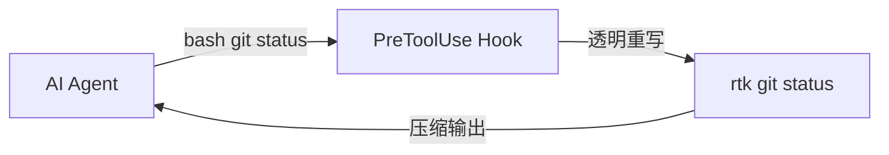

# RTK Token 效率优化协议（Rust Token Killer）

> **来源**: rtk-ai/rtk (GitHub) — 39K+ ★, MIT, Rust
> **初融**: 2026-05-04 | **蒸馏更新**: 2026-05-19 (v0.35+)
> **定位**: Tier 2 上下文激活 (CLI/终端任务时加载)
> **核心**: CLI 输出压缩，降低 LLM token 消耗 60-90%

---

## 🎯 核心原理

RTK 是一个 Rust CLI 代理。它在 Shell 和 LLM 之间拦截命令输出，压缩后送入上下文窗口。

**实测 2,927 条命令：89.2% 噪音去除，输入 11.6M → 输出 1.4M tokens。**

四种过滤策略：

| 策略 | 说明 | 示例 |
|------|------|------|
| **Smart Filtering** | 去除注释、空白、样板文本 | `cargo test` 262个pass→1行摘要 |
| **Grouping** | 同类聚合 | 文件按目录分组、错误按类型聚合 |
| **Truncation** | 只保留信号，去掉冗余 | `git push` 15行→1行 |
| **Deduplication** | 重复日志行折叠为计数 | 相同警告合并为 `x17` |

---

## 🛠 命令覆盖（100+ 命令）

### Git（最大节省来源之一）
| 命令 | 原始 | 压缩后 | 节省 |
|------|:----:|:------:|:----:|
| `git status` | ~2,000 tokens | ~400 | 80.8% |
| `git diff` | ~10,000 tokens | ~2,500 | 75% |
| `git push` | 15行 | 1行 `ok main` | - |
| `git log -n 10` | 全行输出 | 每行一条 | - |
| `git pull` | 多行 | `ok 3 files +10 -2` | - |

### 测试运行器（最大节省点 — 91.8%）
| 命令 | 原始 | 压缩后 |
|------|:----:|:------:|
| `cargo test` | 200+ 行（含262个pass） | ~20行（仅failures+汇总） |
| `pytest` | 33 passed + 逐条 | `33 passed in 0.02s` |
| `go test` | 多语言测试逐条 | 仅failures |
| `jest / vitest` | 逐条结果 | 仅failures |
| `playwright test` | 全输出 | 仅failures |
| `rspec` | 全输出 | 仅failures |

### 构建与 lint
| 命令 | 压缩策略 |
|------|---------|
| `tsc` | TypeScript 错误按文件分组 |
| `ruff check` | Python lint 错误聚合 |
| `cargo clippy` | Rust 警告折叠 |
| `golangci-lint run` | 按类别聚合 |

### 文件操作
| 命令 | 压缩策略 |
|------|---------|
| `ls` | token 优化目录树 |
| `cat` / `read` | 智能文件读取 |
| `grep` | 匹配行聚合（49.5% 节省） |
| `find` | 结果折叠（78.3% 节省） |

### DevOps（扩展覆盖）
| 领域 | 命令 |
|------|------|
| AWS | 25个子命令过滤 |
| Docker | `docker build/pull/ps` 等 |
| Kubernetes | `kubectl get/describe/logs` 等 |
| GitHub CLI | `gh pr merge` 等透传 |

---

## ⚡ 安装与接入

### 安装（单 Rust 二进制，零依赖）
```bash
# macOS
brew install rtk

# Linux/macOS
curl -fsSL https://raw.githubusercontent.com/rtk-ai/rtk/refs/heads/master/install.sh | sh

# 或 Cargo
cargo install --git https://github.com/rtk-ai/rtk
```

⚠️ crates.io 上另有同名包 "rtk" (Rust Type Kit)，安装后运行 `rtk gain` 验证。

### 接入 AI 工具
```bash
rtk init -g                    # Claude Code / Copilot
rtk init -g --agent cursor     # Cursor
rtk init -g --gemini           # Gemini CLI
rtk init --agent windsurf      # Windsurf
rtk init --agent cline         # Cline / Roo Code
```

### 验证效果
```bash
rtk gain
# 📊 RTK Token Savings
# Total commands:    2,927
# Input tokens:      11.6M
# Output tokens:     1.4M
# Tokens saved:      10.3M (89.2%)
```

---

## 🔄 自钩子模式（关键特性）

最实用的特性：**透明重写 hook**。



一旦 `rtk init -g`，CLI 命令被自动重写。Agent 不知道 RTK 的存在，只收到更小更干净的输出。

---

## 🔬 与太一系统的融合

### 已有融合
我们已在 TOKEN-CONSERVATION.md 中吸收了 RTK 的核心精神（本地优先、去重加载、上下文压缩）。

### 本次蒸馏新增
1. **四种过滤策略** — 不再只是"过滤冗余"，而是精确分类：Smart Filtering / Grouping / Truncation / Deduplication
2. **Test runner 压缩模式** — 测试输出是最大 token 浪费点，仅保留 failures + 汇总
3. **rtk gain 指标仪表盘** — 量化 token 节省，可用于 SRE 报表
4. **自钩子模式** — 无感集成，无需手动前缀
5. **DevOps 扩展** — AWS/Docker/K8s/GH CLI 覆盖

### 太一场景映射

| 太一场景 | RTK 策略 | 预期节省 |
|---------|---------|:-------:|
| `exec` 系统命令 | 过滤无意义输出 | 60-90% |
| CI/CD 日志分析 | Deduplication + Truncation | 可忽略 |
| 情报管线 curl 调用 | Smart Filtering（去头尾样板） | ~50% |
| `cargo test` / `pytest` 输出 | Test runner 模式 | 91.8% |
| `git diff` / `git log` | Git 命令压缩 | 75-80% |
| Docker/AWS 操作 | DevOps 扩展 | 按需 |

### 不采用
- **安装 RTK 二进制本身** — 太一通过 OpenClaw 执行命令，而非直接对接 Shell。但策略层完全兼容。
- **ICM / Vox** — ICM（上下文管理）和 Vox（语音）与现有冲突，不需接入。

---

## 📊 Token 优化效果汇总

| 场景 | 原始 Token | 过滤后 | 节省 |
|------|:---------:|:------:|:----:|
| `cargo test` | 5,000+ | ~400 | 91.8% |
| `git status` | 2,000 | ~400 | 80.8% |
| `find` | 大量 | 折叠 | 78.3% |
| `grep` | 按匹配 | 聚合 | 49.5% |
| `git diff` | 10,000 | 2,500 | 75% |
| **全量(2927条)** | **11.6M** | **1.4M** | **89.2%** |

---

## ⚖️ 注意事项

1. **测试失败时不要过度过滤** — 保留完整的错误栈和上下文
2. **hook 化后调试** — 如需原始输出，`RTK_DISABLE=1 git status`
3. **命令黑白名单** — 敏感命令（如 `rm`、`sudo`）自动透传不压缩
4. **版本兼容** — v0.35+ 稳定，定期 `rtk update` 更新
5. **成本换算** — 团队10人每月约节省 $1,750（基于 API 定价）

---

*rtk-ai/rtk · Rust Token Killer · 太一宪法融合版*
*49.6K ★ · MIT · Zero Telemetry · Zero Config*
