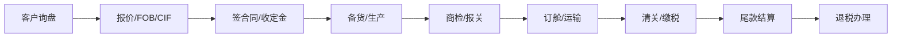

# GE2 中国折叠房屋出口实战指南

> **月刊·W2 | 生成时间**: 2026-05-18 14:40 CST
> **定位**: 面向中国折叠房屋/模块化建筑厂商的出口全流程操作手册
> **衔接**: 基于 GE1（市场趋势分析）的实操落地篇

---

## 目录

1. [行业出口总览](#一行业出口总览)
2. [HS编码与关税体系](#二hs编码与关税体系)
3. [目标市场认证矩阵](#三目标市场认证矩阵)
4. [出口流程与单证](#四出口流程与单证)
5. [物流方案](#五物流方案)
6. [支付与结算](#六支付与结算)
7. [中国出口政策支持](#七中国出口政策支持)
8. [主要出口区域实战指南](#八主要出口区域实战指南)
9. [案例库](#九案例库)
10. [风险与合规](#十风险与合规)
11. [出口Checklist](#十一出口checklist)

---

## 一、行业出口总览

### 1.1 产品分类与海关归类

折叠房屋产品形态多样，出口时需按以下分类确定 HS 编码：

| 产品类型 | 描述 | HS编码 (2025版) | 申报要素 |
|---------|------|----------------|---------|
| **钢结构活动房屋** | 折叠式集装箱房、彩钢夹芯板房 | **9406.10.00** | 结构、材质、尺寸、用途 |
| **木结构预制房屋** | 木制折叠/拼装房 | **9406.20.00** | 结构、材质、尺寸 |
| **其他预制房屋** | 铝合金、复合材料等 | **9406.90.00** | 结构、材质、尺寸 |
| **彩钢夹芯板** (出口后当地组装) | 作为建材出口 | **7210.xx / 7212.xx** | 材质、规格 |
| **集装箱改造房屋** | 二手/新集装箱改装 | **8609.00.90** 或 **9406.10.00** | 依是否永久性固定使用 |

> 💡 **关键判断**：已完成折叠组装、可直接居住的房屋 → 94章（9406）；作为板材/结构件出口 → 按材料归入 72-73章（钢材）或 44章（木材）。

### 1.2 中国出口产业带分布

| 产业集群 | 核心城市 | 特点 | 主流出口品类 |
|---------|---------|------|------------|
| **长三角** | 上海、浙江湖州/绍兴、江苏南通 | 产业链完整、配套齐全、设计能力较强 | 中高端折叠别墅、模块化建筑 |
| **珠三角** | 佛山、广州、深圳 | 出口经验丰富、规模灵活、成本优势 | 折叠集装箱房、劳工营模块 |
| **环渤海** | 天津、青岛、河北廊坊 | 钢铁原材料产地、大厂集中 | 重型钢结构折叠房、大型项目 |
| **中部** | 武汉、长沙、郑州 | 成本优势明显、新兴产区 | 经济型折叠房、临时住房 |

### 1.3 出口价格区间参考（FOB）

| 产品级别 | 规格 | FOB单价 (USD) | 目标市场 |
|---------|------|--------------|---------|
| 经济型折叠房 | 20ft单节（18㎡） | $1,500 - $3,000 | 非洲、东南亚、中东劳工营 |
| 标准型折叠房 | 20ft可扩展（36㎡） | $3,500 - $6,000 | 中东、拉美、东南亚 |
| 中高端折叠别墅 | 40ft多节（60-120㎡） | $8,000 - $25,000 | 欧美、澳洲、中东高端 |
| 定制模块化建筑 | 多层/大型 | $50,000 - $200,000+ | 全球机构项目 |

---

## 二、HS编码与关税体系

### 2.1 主要目标市场关税一览（HS 9406.10/20/90）

| 目标市场 | 基础关税 | 备注 |
|---------|---------|------|
| **沙特** | 5% | GCC统一关税5%，无额外附加税 |
| **阿联酋** | 5% | GCC统一关税 |
| **美国** | 0-2.5% | 无301条款附加税（预制建筑暂未覆盖） |
| **欧盟** | 2.7% | 部分国家可申请绿色建筑关税减免 |
| **英国** | 2.7% | 同欧盟过渡期后税率 |
| **澳大利亚** | 5% | 中澳FTA可享受0%关税（需原产地证） |
| **日本** | 0% | 中日FTA/E-Commerce协定，部分品类零关税 |
| **韩国** | 8% | 中韩FTA逐年降税中 |
| **东南亚(ASEAN)** | 0% | 中国-东盟FTA：预制建筑零关税 |
| **南非** | 10-15% | SACU关税较高，无FTA优惠 |
| **巴西** | 14-20% | 南共市对外关税，无FTA |
| **尼日利亚** | 5-20% | 视具体海关估值而定 |

### 2.2 中国出口退税

| HS编码 | 退税率 | 说明 |
|-------|--------|------|
| 9406.10.00 (钢结构房屋) | **13%** | 全额退税，钢结构预制建筑最高一档 |
| 9406.20.00 (木结构房屋) | **10%** | 木制品退税略低 |
| 9406.90.00 (其他预制房屋) | **13%** | 全额退税 |
| 材料类出口(如彩钢板) | 0-13% | 按具体材料HS编码确定 |

> 🎯 **出口退税 ROI 计算**：以 FOB $5,000 的折叠房为例，退税约 $650 (¥4,700)，可覆盖约 6-8% 的物流成本。

### 2.3 反倾销/反补贴风险

| 市场 | 风险等级 | 现状 |
|------|---------|------|
| 美国 | 🟡 中 | 钢材产品有反倾销历史，预制建筑暂未涉及，但需关注HS 9406大类动态 |
| 欧盟 | 🟢 低 | 目前无相关反倾销措施 |
| 印度 | 🟠 高 | 对钢铁制品反倾销频繁，出口印度需提前做原产地合规审查 |
| 土耳其 | 🟡 中 | 对部分中国钢铁产品有反倾销税 |
| 加拿大 | 🟢 低 | 未见预制建筑反倾销案例 |

---

## 三、目标市场认证矩阵

### 3.1 认证全景图

| 市场 | 认证 | 认证机构 | 费用范围 | 周期 | 必要性 |
|------|------|---------|---------|------|-------|
| **欧盟** | **CE** (EN 1090 / CPR 305/2011) | 公告机构(TÜV/BV等) | €5,000-15,000 | 6-12周 | ⭐ 强制 |
| **欧盟** | **ETA** (欧洲技术评估) | EOTA | €20,000-50,000 | 6-12月 | 新品上市需要 |
| **美国** | **IBC 认证** (ICC-ES) | ICC-ES | $10,000-30,000 | 3-6月 | ⭐ 强制 |
| **美国** | **UL** 电气安全 | UL | $5,000-20,000 | 4-8周 | 含电气设备需 |
| **沙特** | **SASO / SABER** | SASO授权机构 | SAR 5,000-20,000 | 2-4周 | ⭐ 强制 |
| **阿联酋** | **ESMA / Civil Defense** | ESMA | AED 10,000-30,000 | 3-6周 | ⭐ 强制 |
| **俄罗斯/CIS** | **EAC / GOST-R** | EAC认证机构 | $3,000-8,000 | 4-8周 | ⭐ 强制 |
| **澳大利亚** | **NCC / BCA 认证** | CodeMark | AUD 8,000-20,000 | 6-12周 | ⭐ 强制 |
| **日本** | **JIS / 建筑基准法** 认定 | MLIT指定机构 | ¥300,000-1,000,000 | 3-6月 | ⭐ 强制 |
| **东南亚** | **SNI** (印尼) | BSN | $3,000-5,000 | 4-8周 | 强制 |
| **非洲** | **SONCAP** (尼日利亚) | SON | $2,000-5,000 | 2-4周 | 强制 |
| **全球** | **ISO 9001/14001** | 认证机构 | $5,000-15,000 | 2-3月 | 商业必要 |

### 3.2 认证策略建议

**低成本快攻路线**（非洲/东南亚/中东劳工营）：
1. 获得 ISO 9001（底线门槛）+ SASO/ESMA（中东）
2. 无需 CE/IBC 等高成本认证
3. 适用产品：经济型折叠房 <$5,000/套

**品牌化路线**（欧洲/美国/澳洲/中东高端）：
1. CE 认证 + EN 1090 钢结构认证（欧盟必备）
2. ICC-ES 认证（美国）
3. NCC CodeMark（澳洲）
4. 适用产品：中高端折叠别墅 $15,000+

### 3.3 中国出口资质要求

| 资质 | 颁发机构 | 说明 |
|-----|---------|------|
| **出口经营权备案** | 商务部 | 必须，线上办理即可 |
| **海关报关单位注册** | 海关总署 | 必须，获10位海关编码 |
| **原产地证** | 贸促会/海关 | FTA关税减免用，线上自助打印 |
| **检验检疫** | 海关 | 预制建筑一般无需法检 |
| **增值税退税备案** | 税务局 | 出口退税前置程序 |
| **ISO体系认证** | 第三方 | 非强制，但海外买家普遍要求 |

---

## 四、出口流程与单证

### 4.1 标准出口流程图

### 4.2 出口核心单证清单

| 单证 | 出具机构 | 备注 |
|-----|---------|------|
| **商业发票** (Commercial Invoice) | 出口商自拟 | 含HS编码、数量、单价、总金额 |
| **装箱单** (Packing List) | 出口商自拟 | 逐件标注尺寸/重量/件数 |
| **提单** (B/L) | 船公司/货代 | 海运提单或电放提单 |
| **原产地证** (CO/Form A/Form F) | 贸促会/海关 | FTA优惠用，Form A给普惠制国家 |
| **保险单** | 保险公司 | CIF条件下由出口方投保 |
| **报关单** | 海关 | 通过"单一窗口"系统提交 |
| **检验检疫证书** | 海关 | 如客户要求或法检商品 |
| **CE/ISO证书** | 公告机构 | 目的国清关可能要求 |
| **材料检测报告** | SGS/BV/第三方 | 材质、防火、承重检测 |
| **熏蒸/消毒证** | 海关 | 木制包装/木结构房屋出口需 |

### 4.3 进出口贸易术语建议

| 贸易术语 | 适用场景 | 出口方责任 | 风险点 |
|---------|---------|-----------|-------|
| **FOB 中国港口** | 新手出口、首次合作 | 工厂→装船港交货 | 买方指定货代可能不配合 |
| **CFR/C&F 目的港** | 出口方控制物流 | FOB+运费 | 运费波动风险 |
| **CIF 目的港** | 常规B2B交易 | FOB+运费+保险 | 保险费率需谈判 |
| **DDP 买方仓库** | 欧美品牌客户 | 全程包税包送货 | 清关风险全部由卖方承担 |
| **EXW 工厂** | 大客户自提 | 最小责任 | 报价最低 |

> 🎯 **推荐**: 初期用 FOB 起步，稳定后切换 CIF 以控制全程物流和利润空间。

---

## 五、物流方案

### 5.1 折叠房屋出口物流关键参数

| 运输方式 | 适用场景 | 时效 | 成本 (40HQ柜. 中国→中东) | 注意事项 |
|---------|---------|------|------------------------|---------|
| **海运整柜(FCL)** | 批量出口 >15套 | 15-25天 | $3,000-5,500 | 标准20尺/40尺柜 |
| **海运拼柜(LCL)** | 样品/小批量 | 20-30天 | $200-500/m³ | 需注意装箱方案 |
| **滚装船(RoRo)** | 超大型模块 | 20-30天 | 按件计费 | 超大模块专用 |
| **铁路(中欧班列)** | 欧盟/中亚 | 15-20天 | $6,000-9,000/40HQ | 时效快于海运，成本更高 |
| **空运** | 样品/紧急部件 | 3-7天 | $5-15/kg | 仅适用于小件/配件 |

### 5.2 折叠状态下的装箱方案

| 产品规格 | 折叠后尺寸 | 20GP装量 | 40HQ装量 | 立方/柜 |
|---------|-----------|---------|---------|--------|
| 20ft 单节折叠房 | ~5.9×2.4×2.6m | 1套 | 2套 | 28m³ |
| 20ft 可扩展折叠房 | ~5.9×2.4×2.2m(折叠) | 1套 | 2套 | 30m³ |
| 40ft 折叠别墅 | ~5.9×2.4×2.6m | 1套(分2箱) | 1套+配套 | 54m³ |
| 平板包装部件 | 定制包装 | 按设计 | 按设计 | 可优化至90%装载率 |

> 🚢 **装载率提升技巧**: 将家具、门窗、太阳能板等配套物品塞入折叠房内部空腔运输，可降低20-30%的单位物流成本。

### 5.3 主要出口港口与航线

| 起运港 | 优势航线 | 到港时间(中东) | 到港时间(非洲) | 到港时间(欧洲) |
|-------|---------|--------------|--------------|--------------|
| **上海** | 全球覆盖 | 18-22天(杰贝阿里) | 25-30天(拉各斯) | 25-30天(汉堡) |
| **宁波** | 全球覆盖 | 同上 | 同上 | 同上 |
| **深圳/蛇口** | 东南亚、中东优势 | 15-18天 | 20-25天 | 28-32天 |
| **广州南沙** | 非洲航线密集 | 18-22天 | 18-22天 | 30-35天 |
| **天津新港** | 中亚铁路衔接 | 16-20天 | 28-35天 | 35-40天 |
| **青岛** | 日韩/美西优势 | 20-25天 | 30-35天 | 30-35天 |

### 5.4 目的港偏港加费

| 目的国 | 主要港口 | 偏港加费 | 建议 |
|-------|---------|---------|------|
| 沙特 | 达曼、吉达 | +$300-800/柜 | 内陆项目建议走达曼(东海岸) |
| 阿联酋 | 杰贝阿里 | 基准港 | 覆盖阿联酋及转口中东 |
| 尼日利亚 | 阿帕帕、廷坎 | +$500-1,500/柜(拥堵费) | 建议走廷坎，阿帕帕拥堵严重 |
| 安哥拉 | 罗安达 | +$500-1,000/柜 | 码头效率低 |
| 肯尼亚 | 蒙巴萨 | +$300-600/柜 | 东非枢纽，覆盖乌干达/坦桑 |

---

## 六、支付与结算

### 6.1 支付方式对比

| 支付方式 | 安全性 | 成本 | 适用场景 | 操作要点 |
|---------|-------|------|---------|---------|
| **T/T 电汇** (30%预付+70%见提单副本) | ⭐⭐⭐⭐ | 低(0.1-0.3%) | **推荐**：熟客、中小订单 | 收到预付款再生产，尾款到账放单 |
| **T/T 100%预付** | ⭐⭐⭐⭐⭐ | 低 | 首单/高风险市场 | 影响成单率 |
| **L/C 信用证** (即期) | ⭐⭐⭐⭐⭐ | 中(1-3%) | 大额订单、中东/非洲 | 严格审证，不符点费用高 |
| **L/C 远期** (30-90天) | ⭐⭐⭐⭐ | 中高 | 大型工程项目 | 可做福费廷贴现回笼资金 |
| **D/P 付款交单** | ⭐⭐⭐ | 低 | 谨慎使用 | 买方如不赎单，货物在港产生费用 |
| **D/A 承兑交单** | ⭐⭐ | 低 | ⚠️ 不推荐 | 无物权控制，风险极高 |
| **信保/保理** | ⭐⭐⭐⭐ | 中(0.5-2%) | 大客户赊销 | 需投保中国信保(中信保/Sinosure) |

### 6.2 中国出口信用保险

| 保险产品 | 承保范围 | 费率 | 适用 |
|---------|---------|------|------|
| 短期出口信用保险 | 最长360天 | 0.3-1.5% | B2B出口通用 |
| 中长期出口信用保险 | 2年以上 | 按项目 | 大型工程项目 |
| 特定合同保险 | 单笔合同 | 0.5-2% | 单品出口 |

> **中国信保官网**: sinosure.com.cn | 年费约¥3,000-10,000（按投保额）

### 6.3 汇率风险管理

| 工具 | 说明 | 成本 |
|-----|------|------|
| **远期结汇** | 锁定未来汇率 | 0-1% 保证金 |
| **人民币计价** | 直接报RMB价格 | 零成本，可推给中东/非洲客户 |
| **美元+波动条款** | 汇率波动>2%时重新定价 | 合同条款约定 |
| **多币种收汇** | 美元/欧元/阿联酋迪拉姆 | 需开多币种账户 |

> 💡 折叠房屋平均生产周期 30-60 天，期间汇率波动约 ±2-3%，需锁定或转嫁。

---

## 七、中国出口政策支持

### 7.1 国家级出口促进政策

| 政策 | 内容 | 受益对象 |
|-----|------|---------|
| **出口退税** | 预制建筑13%全额退税 | 所有出口企业 |
| **中信保补贴** | 中小企业出口信保保费补贴50% | 年出口额<500万美元 |
| **境外展会补贴** | 中小企业境外参展费补贴50-70% | 中小企业 |
| **跨境电商综试区** | 简化申报、通关便利 | 平台卖家(B2B/B2C) |
| **中欧班列补贴** | 每柜补贴$1,000-3,000 | 出口欧洲企业 |
| **RCEP 原产地累积规则** | 区域内材料可累积计算原产地 | RCEP贸易链 |
| **"一带一路"项目** | 政策性金融支持 | 涉及沿线国基建项目 |

### 7.2 地方政策（重点产区）

| 省/市 | 政策亮点 |
|-------|---------|
| **浙江** | 跨境电商出口额满$10万补贴¥5万；“千企万品”出海行动 |
| **广东** | 出口信用保险保费补贴50%；海外仓建设补贴 |
| **山东** | 预制建筑出口专项扶持，钢材退税快返 |
| **天津** | 出口退税7个工作日内到账（全国最快） |
| **河北** | 钢结构出口专项补贴，每吨出口补贴¥50-100 |

### 7.3 金融机构支持

| 银行 | 特色产品 | 适用场景 |
|-----|---------|---------|
| **中国银行** | 出口买方信贷、福费廷 | 大额L/C出口 |
| **中国进出口银行** | 优惠出口买方信贷 | "一带一路"大型项目 |
| **工商银行** | 跨境人民币结算 | 新兴市场人民币收款 |
| **招商银行** | 线上秒级结汇 | 中小额T/T收款 |
| **中信保** | 信保融资 | 赊销出口的资金周转 |

---

## 八、主要出口区域实战指南

### 8.1 🇸🇦 沙特市场

**市场机会**: Vision 2030 推动 $1.5万亿基建，劳工营+保障房需求爆发

| 维度 | 详情 |
|------|------|
| **关税** | 5% (GCC统一) |
| **认证** | SABER电子认证 (无需SASO实体检测) |
| **清关** | 需SABER COC + 发票 + 提单 |
| **支付习惯** | L/C 即期为主，T/T预付 |
| **本地代理** | ⭐ 必须有沙特本地代理商或注册分公司 |
| **标准要求** | 防火等级需满足沙特标准(SBC 801) |
| **物流** | 达曼港(东海岸) → 内需项目；吉达港(西海岸) → 麦加/麦地那 |
| **文化注意** | 周五不办公；穆斯林礼节；Ramadan期间工作时间缩短 |
| **旺季** | 10月-3月 (气候适宜施工) |
| **淡季** | 6月-9月 (45°C+高温，施工暂停) |

**沙特验厂常见要求**: ISO 9001 / 工厂规模 / 出口记录 / 沙特在当地的项目参考

### 8.2 🇦🇪 阿联酋市场

**市场机会**: Expo City 后续开发 + 度假村 + 劳工营

| 维度 | 详情 |
|------|------|
| **关税** | 5% |
| **认证** | ESMA + Dubai Civil Defense |
| **清关** | 相对灵活，迪拜=贸易自由港 |
| **支付习惯** | T/T；可接受L/C |
| **本地代理** | 建议有，非强制(可走自由区公司) |
| **转口优势** | 杰贝阿里港可免税转口中东/非洲 |
| **销售渠道** | Big 5展会是核心触达点(每年11月) |

### 8.3 🇺🇸 美国市场

**市场机会**: FEMA 采购 + 高价位市场，Boxabl的成功已验证需求

| 维度 | 详情 |
|------|------|
| **关税** | 0-2.5% (注意301条款动态) |
| **认证** | ICC-ES 认证 ($10,000-30,000, 3-6月) |
| **标准** | IBC建筑规范，各州可能有差异 |
| **支付** | T/T 或 L/C，大单多走 L/C |
| **物流** | 西海岸(洛杉矶/长滩) 12-18天，东海岸(纽约/萨凡纳) 25-30天 |
| **市场进入** | 需要美国代理/进口商，且承担较高责任险 |
| **机会点** | 自然灾害频发(飓风、山火)，快速住房需求大 |
| **风险** | 产品责任诉讼成本高，需购买产品责任险 |

### 8.4 🇪🇺 欧盟市场

**市场机会**: 绿色建筑推动，循环经济合规 = 进入门槛 = 竞争壁垒

| 维度 | 详情 |
|------|------|
| **关税** | 2.7% |
| **认证** | CE (CPR 305/2011 + EN 1090) |
| **材料要求** | 回收钢材/复合材料需提供环保合规证明 |
| **物流** | 中欧班列 15-20天/$6,000-9,000 或 海运 30-35天/$3,000-5,000 |
| **销售** | 德国/荷兰/北欧 = 重点市场 |
| **展会** | BAU (慕尼黑) / Big 5 (与中东同平台) |

### 8.5 🌏 东南亚市场

**市场机会**: 中国-东盟FTA零关税 + 基建需求旺盛

| 维度 | 详情 |
|------|------|
| **关税** | 0% (中国-东盟FTA) |
| **认证** | 各国本地标准(印尼SNI、越南TCVN等) |
| **物流** | 海运 5-12天，成本最低 |
| **支付** | T/T 为主 |
| **机会点** | 印尼新首都(IKN Nusantara)、菲律宾保障房 |
| **风险** | 部分国家海关灰色清关成本高 |

### 8.6 🌍 非洲市场

**市场机会**: 中国"一带一路"基建配套，低端劳工营刚需

| 维度 | 详情 |
|------|------|
| **关税** | 10-20% (各国不等) |
| **认证** | SONCAP(尼日利亚)/PVoC(肯尼亚)/各国有 |
| **支付** | L/C (非洲国家外汇管制严重) **不建议T/T赊销** |
| **物流** | 20-35天，主要港口拥堵严重 |
| **核心市场** | 尼日利亚、肯尼亚、安哥拉、加纳、埃塞俄比亚 |
| **保险** | ⭐ 必须投保中信保，非洲买方违约风险高 |
| **项目线索** | 中国企业在非洲的工程项目(配套营地需求) |

---

## 九、案例库

### 案例1: 青岛海容 → 沙特劳工营项目

| 项目 | 详情 |
|------|------|
| **规模** | 2,000套折叠房 |
| **金额** | $1,200万 |
| **认证** | SABER COC |
| **物流** | 青岛→达曼港，20天 |
| **支付** | L/C 即期 |
| **亮点** | 获沙特NEOM项目配套资质，后续订单持续 |
| **教训** | 初始因防火等级不达标，被退回重做隔热芯材 |

### 案例2: 天津北洋 → 迪拜工地劳工营

| 项目 | 详情 |
|------|------|
| **规模** | 500套折叠房 |
| **金额** | $250万 |
| **物流** | 天津→杰贝阿里，18天 |
| **模式** | 与当地组装厂合作，中国供料+当地组装 |
| **支付** | 30% T/T预付 + 70% 见提单副本 |
| **亮点** | 提供20年设计寿命产品，获得二次回购 |

### 案例3: 佛山宏福 → 肯尼亚中资项目

| 项目 | 详情 |
|------|------|
| **规模** | 1,000套 |
| **金额** | $380万 |
| **认证** | KEBS (肯尼亚标准局) |
| **物流** | 广州南沙→蒙巴萨港，22天 |
| **支付** | 中信保承保+中国银行福费廷 |
| **亮点** | 通过中国在非工程项目实现"搭车出口" |
| **教训** | 蒙巴萨港拥堵3周，逾期罚款严重 |

### 案例4: 浙江法狮龙(Fsilon) → 欧盟市场

| 项目 | 详情 |
|------|------|
| **模式** | CE认证 + 荷兰代理 |
| **产品** | 定制化折叠别墅，60-120㎡ |
| **单价** | €15,000-40,000/套 |
| **认证投入** | CE+EN 1090，约€12,000 |
| **渠道** | 德国建筑展BAU获客 |
| **出货** | 义乌→汉堡港 (海运 30天) |
| **特点** | 欧洲客户对可持续材料要求高，需提供FSC/PEFC认证 |

---

## 十、风险与合规

### 10.1 出口风险矩阵

| 风险类型 | 概率 | 影响 | 应对措施 |
|---------|------|------|---------|
| **目的港滞港费** | 🟡 中 | 🟠 中 | 提单背书"DETENTION FREE 7-14 DAYS" |
| **买家违约拒付** | 🟠 中高 | 🔴 高 | 中信保投保 + 至少30%预付款 |
| **汇率波动** | 🟡 中 | 🟡 中 | 远期结汇锁汇 |
| **产品质量争议** | 🟡 中 | 🟠 中 | 出口前SGS/BV第三方验货 |
| **认证合规不符** | 🟡 中 | 🔴 高 | 出口前向目的国认证机构预审 |
| **目的港清关受阻** | 🟡 中 | 🔴 高 | 提前获取目的国进口政策/报关材料 |
| **钢材价格波动** | 🟡 中 | 🟡 中 | 合同加入原材料价格浮动条款 |
| **海运运费暴涨** | 🟡 中 | 🟠 中 | CIF报价含运费浮动条款或锁定长期约价 |
| **知识产权纠纷** | 🟢 低 | 🔴 高 | 出口前做FTO专利检索 |
| **制裁/贸易禁令** | 🟢 低 | 🔴 高 | 定期核实在受制裁国家清单上的状态 |

### 10.2 合同关键条款

| 条款 | 建议内容 |
|-----|---------|
| **价格条款** | FOB/CIF + 原材料价格浮动不超过±10% |
| **付款条款** | 30% T/T预付 + 70% 见提单副本支付（不可撤销） |
| **交货期** | 明确"工厂备妥日"和"装船日"，逾期罚款不超过合同金额5% |
| **质量标准** | 引用具体标准号（如EN 1090, SASO等），避免笼统描述 |
| **争议解决** | 推荐HKIAC（香港国际仲裁中心）或CIETAC（中国贸仲委） |
| **适用法律** | 中国法律/UN CISG（联合国国际货物销售合同公约） |
| **不可抗力** | 涵盖原材料价格暴涨、海运中断、极端天气 |
| **知识产权** | 设计权归属，买方定制设计的保密条款 |
| **检验** | 出口前由SGS/BV等第三方检验，买方书面确认后发货 |

### 10.3 知识产权风险

| 风险 | 说明 | 应对 |
|-----|------|------|
| 折叠机制专利 | Boxabl、KODA等有折叠机制相关专利 | 出口前做FTO分析 |
| 设计外观专利 | 目标市场可能已有类似设计注册 | 委托当地律所做检索 |
| 品牌侵权 | 使用近似品牌名/商标 | 全球商标检索 + 目标国商标注册 |

---

## 十一、出口Checklist

### 📋 首次出口折叠房屋自查清单

#### □ 资质准备阶段

- [ ] 商务部出口经营权备案 ✅
- [ ] 海关报关单位注册，获10位编码 ✅
- [ ] 电子口岸卡（IC卡/U盾） ✅
- [ ] 开立外汇账户（美元/欧元等） ✅
- [ ] 出口退税备案（税务局） ✅
- [ ] ISO 9001 证书（推荐） ✅

#### □ 市场准入阶段

- [ ] 选定目标市场，确定HS编码 ✅
- [ ] 确认目的国认证要求（CE/SASO/ESMA等） ✅
- [ ] 开始认证申请流程 ✅
- [ ] 确认关税税率及FTA优惠资格 ✅
- [ ] 申请原产地证注册（贸促会/海关） ✅

#### □ 商务谈判阶段

- [ ] 客户背景调查（中信保资信报告） ✅
- [ ] 确定价格条款（FOB/CFR/CIF） ✅
- [ ] 确定支付方式（推荐T/T或L/C） ✅
- [ ] 准备标准销售合同（含仲裁条款） ✅
- [ ] 确认产品技术参数（尺寸/防火/隔热） ✅
- [ ] 提供2D/3D图纸、安装说明书 ✅

#### □ 生产交付阶段

- [ ] 收到预付款（≥30%）后安排生产 ✅
- [ ] 生产过程拍照/录像供客户确认 ✅
- [ ] 第三方验货（SGS/BV） ✅
- [ ] 准备装箱方案，优化装载率 ✅
- [ ] 订舱（提前15-20天） ✅
- [ ] 制作报关单证（发票/装箱单/CO等） ✅
- [ ] 海关申报（单一窗口） ✅

#### □ 出运后阶段

- [ ] 寄送提单正本/电放提单 ✅
- [ ] 催收尾款（见提单副本后） ✅
- [ ] 办理出口退税（电子税务局） ✅
- [ ] 跟踪货物到港状态 ✅
- [ ] 协助买方清关（提供支持文件） ✅
- [ ] 售后跟踪（安装指导/质量反馈） ✅

---

## 附录

### A. 关键联系人/机构

| 机构 | 用途 | 联系方式 |
|-----|------|---------|
| **中国贸促会** (CCPIT) | 原产地证、商事认证 | 各地分会 / www.ccpit.org |
| **中国信保** (Sinosure) | 出口信用保险 | www.sinosure.com.cn / 95588 |
| **海关单一窗口** | 报关、退税申报 | www.singlewindow.cn |
| **SGS** | 第三方验货、认证 | www.sgsgroup.com.cn |
| **TÜV Rheinland** | CE认证 | www.tuv.com/china |
| **Intertek** | 检测认证 | www.intertek.com.cn |
| **中国银行** | 出口结算、福费廷 | www.boc.cn |

### B. 主要展会/平台

| 展会/平台 | 时间 | 地点 | 适合 |
|----------|------|------|------|
| **Big 5 Global** | 每年11月 | 迪拜 | 中东市场 |
| **BAU** | 奇数年1月 | 慕尼黑 | 欧洲市场 |
| **Canton Fair（广交会）** | 4月/10月 | 广州 | 全球买家，B2B最直接 |
| **Alibaba.com** | 全年线上 | B2B平台 | 中小批量出口 |
| **Made-in-China.com** | 全年线上 | B2B平台 | 工业品出口 |
| **Global Sources** | 4月/10月 | 香港 | 欧美买家 |
| **NEOM 展会/项目对接** | 不定期 | 沙特 | 巨型项目机会 |

### C. 参考费率速查

| 项目 | 费率范围 | 备注 |
|-----|---------|------|
| 海运费（中国→中东 40HQ） | $3,000-5,500 | 市场波动，大柜比小柜性价比高 |
| 中信保费率 | 0.3-1.5% | 按国家风险 + 买方资信 |
| T/T电汇手续费 | $15-50/笔 | 中行约0.1% |
| L/C通知/议付费 | 0.5-2% | 按金额 |
| SGS验货费 | $500-1,500/次 | 按货值 + 差旅 |
| 认证年费 | $1,000-5,000/年 | CE/SABER等有续费 |
| 出口退税代理费 | 退税金额的1-3% | 如找代理退税 |

---

> **撰写**: 太一 · 月刊 W2
> **前置报告**: GE1 折叠房屋市场趋势分析
> **数据截止**: 2026-05-18
> **免责声明**: 关税、认证费用、运费等数据为实时参考值，实际操作应以最新的官方公告和报价为准。
