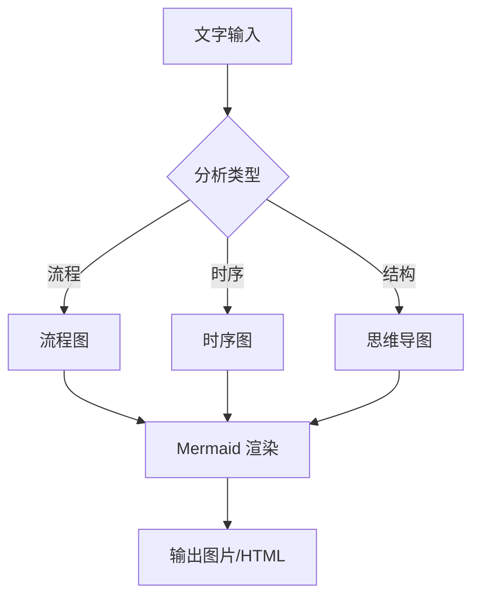

# Chart Generator - 图表自动生成

> **版本**: v1.0  
> **创建时间**: 2026-04-15  
> **职责**: 文字转图表/流程图/信息图  
> **归属**: content-creator 子技能  
> **状态**: ✅ 已部署

---

## 🎯 职责域

**核心功能**: 文字转视觉图表

**适用场景**:
- 文字转流程图
- 文字转思维导图
- 文字转时序图
- 文字转信息图
- 文档可视化

---

## 🧠 核心技术

### 1. Mermaid 集成


### 2. PlantUML 集成
```
@startuml
组件 1 -> 组件 2: 调用
组件 2 -> 组件 3: 处理
@enduml
```

### 3. Graphviz 集成
```
digraph G {
    A -> B;
    B -> C;
    C -> A;
}
```

---

## 🚀 使用说明

### 基础用法
```bash
# 生成流程图
python3 chart_generator.py --type flowchart "开始→处理→结束"

# 生成思维导图
python3 chart_generator.py --type mindmap "主题 {子主题 1, 子主题 2}"

# 生成时序图
python3 chart_generator.py --type sequence "A->B: 消息"
```

### API 用法
```python
from chart_generator import ChartGenerator

generator = ChartGenerator()

# 生成流程图
flowchart = generator.create_flowchart("开始→处理→结束")
flowchart.save("output.png")

# 生成思维导图
mindmap = generator.create_mindmap("主题 {子 1, 子 2}")
mindmap.save_html("output.html")
```

---

## 📊 支持的图表类型

| 类型 | 语法 | 示例 |
|------|------|------|
| 流程图 | flowchart | A→B→C |
| 时序图 | sequence | A->B: 消息 |
| 类图 | class | class A {+method()} |
| 状态图 | state | [*] --> State1 |
| 思维导图 | mindmap | 根 {子 1, 子 2} |
| 甘特图 | gantt | 任务 1:2024-01-01, 10d |
| ER 图 | erDiagram | A ||--o{ B |
| 用户旅程 | journey | 旅程名称：5: 用户 |

---

## 🔗 与其他 Agent 的关系

### 上游 Agent
```
✅ content-creator - 内容创作
✅ shanmu - 内容优化
✅ Design Agent - 视觉设计
```

### 下游 Agent
```
✅ doc-publisher - 文档发布
✅ Telegram Bot - 消息发送
```

### 协作关系
```
content-creator → chart-generator → doc-publisher
     ↓
Design Agent (样式优化)
```

---

*太一 AGI · Chart Generator · 2026-04-15*

**📊 文字转图表，让想法可视化！**
