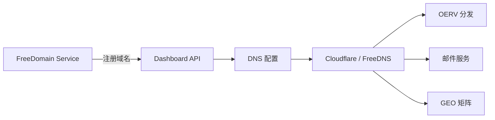

# FreeDomain Skill — 免费域名管理

> 集成自 DigitalPlatDev/FreeDomain (172,663⭐)
> AGPL-3.0 · https://github.com/DigitalPlatDev/FreeDomain

## 概述

DigitalPlat FreeDomain 是一个免费域名服务平台，提供以下免费子域名后缀：

| 后缀 | 状态 |
|------|------|
| `.DPDNS.ORG` | ✅ 可用 |
| `.UL.KG` | ✅ 可用 |
| `.QZZ.IO` | ✅ 可用 |
| `.XX.KG` | ✅ 可用 |
| `.QD.JE` | ✅ 可用 |

已注册超过 **500,000 个域名**，由 Edward Hsing / DigitalPlat Foundation 独立维护。

## 用途

在太一系统中，FreeDomain 可用于：

1. **OERV 分发服务域名** — 为 OERV 叙事引擎分配独立域名
2. **跨境贸易邮件域名** — 开发信/客户沟通专用邮箱域名
3. **GEO 优化着陆页** — 多域名矩阵提升 AI 可见度
4. **代理/测试环境** — 快速搭建设施

## 使用

### 注册域名
1. 访问仪表盘：https://dash.domain.digitalplat.org/
2. 选择可用后缀，注册域名
3. 配置 DNS（支持 Cloudflare / FreeDNS / Hostry 等）

### 域名管理
- **Dashboard**: https://dash.domain.digitalplat.org/
- **Tutorial**: https://github.com/DigitalPlatDev/FreeDomain/tree/main/documents/tutorial
- **FAQ**: https://github.com/DigitalPlatDev/FreeDomain/tree/main/documents/domains/faq.md

### 社区支持
- **Discord**: https://discord.gg/ma4RZzMmVW
- ⚠️ **安全提示**: 该项目的 Telegram 群组已被入侵，请勿信任 Telegram 上的任何消息。

## 太一集成路径

## 使用记录

| 日期 | 操作 | 域名 | 用途 |
|------|------|------|------|
| — | — | — | — |
