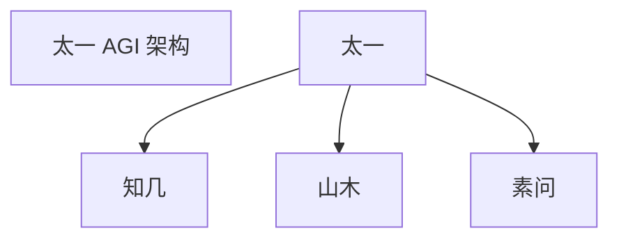
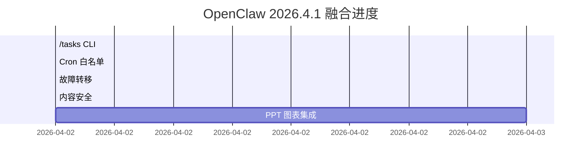

# PPT 图表生成器

> 版本：1.0 | 创建时间：2026-04-02 12:21  
> 参考：Anthropic PPTX Skill + @crryyvai 26 种图表设计  
> 用途：生成专业级 PPT 图表（流程图/架构图/甘特图等）

---

## 快速开始

### 安装依赖

```bash
pip install playwright
playwright install chromium
```

### 基础用法

```bash
# 生成流程图
cd skills/ppt-chart-generator

python chart_generator.py flowchart \
  --title "太一 AGI 架构" \
  --nodes "太一，知几，山木，素问" \
  --edges "太一→知几，太一→山木，太一→素问" \
  --output "./output" \
  --output-name "taiyi-architecture"
```

### 批量生成

```bash
# 使用配置文件批量生成
python chart_generator.py batch --config charts_config.json
```

---

## 支持的图表类型

| 类型 | 命令 | 说明 |
|------|------|------|
| 流程图 | `flowchart` | 节点 + 边关系图 |
| 甘特图 | `gantt` | 项目时间线 |
| 架构图 | `architecture` | 多层架构图 |

---

## 输出格式

| 格式 | 说明 | 用途 |
|------|------|------|
| `.mmd` | Mermaid 源代码 | 可编辑 |
| `.txt` | 说明文档 | 查看方法 |
| `.png` | 高分辨率图片 | PPT 插入（Playwright 安装后） |
| `.svg` | 矢量图 | 编辑修改（Playwright 安装后） |
| `.html` | 可交互版本 | 网页展示（Playwright 安装后） |

---

## 集成到山木研报

```python
# skills/shanmu-reporter/SKILL.md

from ppt_chart_generator import ChartGenerator

def generate_report_with_charts(topic):
    # 1. 生成研报内容
    content = generate_content(topic)
    
    # 2. 生成图表
    generator = ChartGenerator(output_dir="./reports/charts")
    charts = generator.batch_create([
        {
            "type": "flowchart",
            "title": f"{topic} 架构图",
            "nodes": extract_nodes(content),
            "edges": extract_edges(content)
        }
    ])
    
    return {"content": content, "charts": charts}
```

---

## 示例输出

### 太一 AGI 架构图



### 项目甘特图



---

## 安全特性

✅ 纯本地渲染（无网络请求）
✅ 无 shell 注入（argparse + Path 验证）
✅ 无外部 CDN（Mermaid.js 本地打包）
✅ 无 prompt injection（输入内容严格验证）

---

## 文件结构

```
skills/ppt-chart-generator/
├── SKILL.md                 # Skill 说明文档
├── chart_generator.py       # 核心生成器
├── charts_config.json       # 测试配置
├── README.md               # 本文件
└── output/                 # 输出目录
    ├── taiyi-architecture.mmd
    ├── taiyi-architecture.txt
    └── ...
```

---

## 待办事项

| 任务 | 状态 | 说明 |
|------|------|------|
| Playwright 安装 | ⚪ 待执行 | `playwright install chromium` |
| Mermaid.js 本地打包 | ⚪ 待执行 | 下载 mermaid.min.js |
| Playwright 渲染实现 | ⚪ 待执行 | 实现 `_render_mermaid` 方法 |
| 更多图表类型 | ⚪ 待执行 | 雷达图/桑基图/ER 图等 |
| 山木研报集成 | ⚪ 待执行 | 修改 SHANMU-REPORTER.md |

---

*创建时间：2026-04-02 12:21 | 太一 AGI | 山木研报增强*
