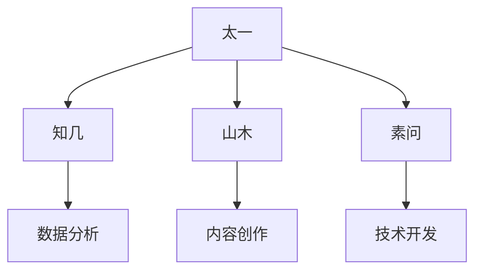
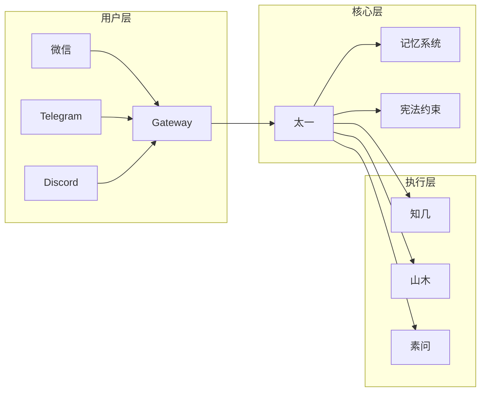
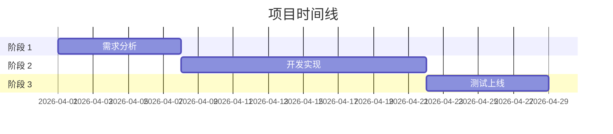

# PPT 图表生成器 Skill

> 版本：1.0 | 创建时间：2026-04-02 12:21  
> 参考：Anthropic PPTX Skill + @crryyvai 26 种图表设计  
> 用途：生成专业级 PPT 图表（流程图/架构图/甘特图等）

---

## 核心功能

**输出格式**：
- PNG 图片（高分辨率）
- HTML 可交互版本
- SVG 矢量图（可编辑）

**支持的图表类型**（10 种核心）：
1. 流程图 (Flowchart)
2. 架构图 (Architecture Diagram)
3. 时序图 (Sequence Diagram)
4. 甘特图 (Gantt Chart)
5. 雷达图 (Radar Chart)
6. 桑基图 (Sankey Diagram)
7. ER 图 (Entity Relationship)
8. 组织架构图 (Org Chart)
9. 思维导图 (Mind Map)
10. 数据看板 (Dashboard)

---

## 技术架构

```
输入 (Markdown/JSON)
    ↓
Mermaid DSL 转换
    ↓
Playwright 渲染 (Chromium)
    ↓
输出 (PNG + HTML + SVG)
```

**依赖**：
- Python 3.10+
- Playwright (Chromium)
- Mermaid.js (本地打包)

---

## 使用方法

### 基础用法

```python
from ppt_chart_generator import ChartGenerator

# 初始化
generator = ChartGenerator(output_dir="./output")

# 生成流程图
generator.create_flowchart(
    title="太一 AGI 架构图",
    nodes=["太一", "知几", "山木", "素问"],
    edges=[("太一", "知几"), ("太一", "山木"), ("太一", "素问")],
    output_name="taiyi-architecture"
)

# 生成甘特图
generator.create_gantt_chart(
    title="项目进度",
    tasks=[
        {"name": "任务 1", "start": "2026-04-01", "end": "2026-04-05"},
        {"name": "任务 2", "start": "2026-04-03", "end": "2026-04-08"},
    ],
    output_name="project-timeline"
)
```

### CLI 用法

```bash
# 生成流程图
python ppt_chart_generator.py flowchart \
  --title "太一 AGI 架构" \
  --nodes "太一，知几，山木，素问" \
  --edges "太一→知几，太一→山木，太一→素问" \
  --output "./output/architecture.png"

# 批量生成
python ppt_chart_generator.py batch \
  --config charts_config.json \
  --output-dir "./output"
```

---

## 集成到山木研报生成器

### 修改 `skills/shanmu-reporter/SKILL.md`

```python
# 添加图表生成步骤
def generate_report_charts(report_data):
    generator = ChartGenerator(output_dir="./reports/charts")
    
    # 生成架构图
    generator.create_flowchart(
        title=report_data["title"],
        nodes=report_data["components"],
        edges=report_data["relationships"],
        output_name=f"{report_data['id']}-architecture"
    )
    
    # 生成进度图
    generator.create_gantt_chart(
        title="项目进度",
        tasks=report_data["timeline"],
        output_name=f"{report_data['id']}-timeline"
    )
    
    return generator.output_files
```

---

## 图表模板示例

### 1. 流程图模板



### 2. 架构图模板



### 3. 甘特图模板



---

## 安全特性

✅ **纯本地渲染** - 无网络请求
✅ **无 shell 注入** - argparse + Path 验证
✅ **无外部 CDN** - Mermaid.js 本地打包
✅ **无 prompt injection** - 输入内容严格验证

---

## 输出示例

### 文件结构

```
output/
├── architecture.png      # 高分辨率图片 (1920x1080)
├── architecture.html     # 可交互版本
├── architecture.svg      # 矢量图 (可编辑)
└── timeline.png          # 甘特图
```

### 图片规格

| 格式 | 分辨率 | 大小 | 用途 |
|------|--------|------|------|
| PNG | 1920x1080 | ~200KB | PPT 插入 |
| SVG | 矢量 | ~50KB | 编辑修改 |
| HTML | 响应式 | ~100KB | 网页展示 |

---

## 与山木研报集成

### 工作流

```
山木接收任务
    ↓
生成研报内容
    ↓
调用 PPT 图表生成器
    ↓
输出：研报文本 + 图表图片
    ↓
太一审阅 → 发布
```

### 代码示例

```python
# skills/shanmu-reporter/SKILL.md 增强版

def generate_research_report(topic):
    # 1. 生成研报内容
    content = generate_content(topic)
    
    # 2. 提取图表数据
    chart_data = extract_chart_data(content)
    
    # 3. 生成图表
    generator = ChartGenerator(output_dir="./reports/charts")
    charts = generator.batch_create(chart_data)
    
    # 4. 整合输出
    return {
        "content": content,
        "charts": charts,
        "format": "markdown+images"
    }
```

---

## 待办事项

| 任务 | 状态 | 说明 |
|------|------|------|
| Playwright 安装 | ⚪ 待执行 | `playwright install chromium` |
| Mermaid.js 本地打包 | ⚪ 待执行 | 下载 mermaid.min.js |
| 10 种图表模板 | ⚪ 待执行 | 每种图表一个模板文件 |
| 山木研报集成 | ⚪ 待执行 | 修改 SHANMU-REPORTER.md |
| 测试验证 | ⚪ 待执行 | 生成测试图表 |

---

## 参考资源

- Anthropic PPTX Skill: https://github.com/anthropics/anthropic-cookbook/tree/main/skills
- Mermaid.js 文档：https://mermaid.js.org/
- Playwright Python: https://playwright.dev/python/

---

*创建时间：2026-04-02 12:21 | 太一 AGI | 山木研报增强*
